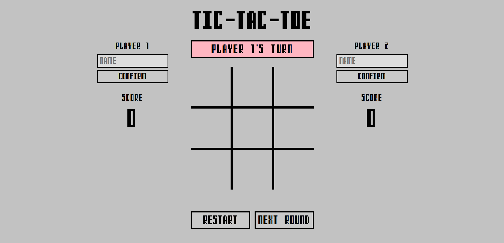
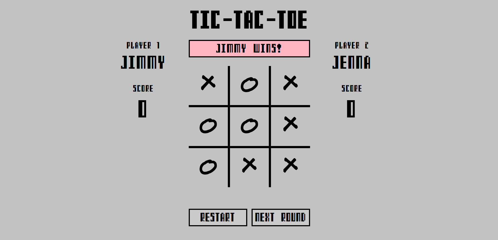

# Tic-Tac-Toe

This is a Tic-Tac-Toe game created as part of The Odin Project curriculum.

### <a href="https://dimitrije108.github.io/tic-tac-toe/">LIVE VERSION</a>

## What I learned

* Creating and using Factory functions
* Using module pattern and IIFEs and how it helps with encapsulation and namespacing
* Learned about Private variables, closures, scope, etc.

---------------------------------------------------------------------------------------------------------------

